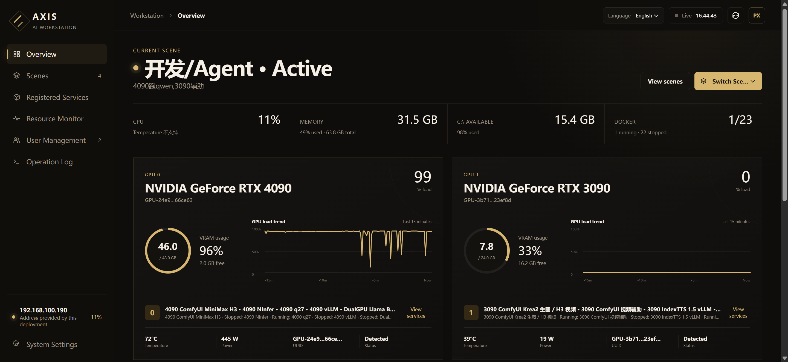
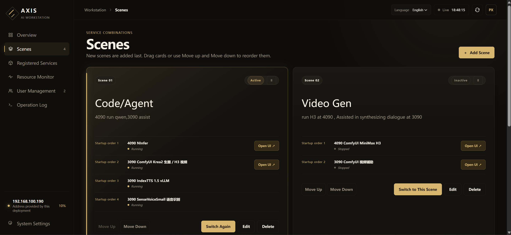
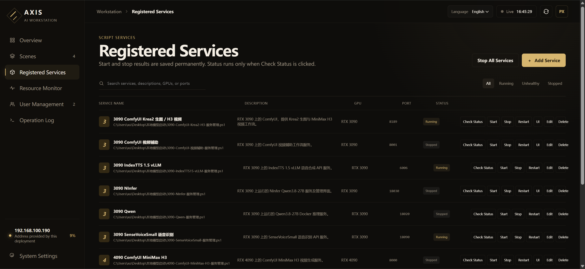
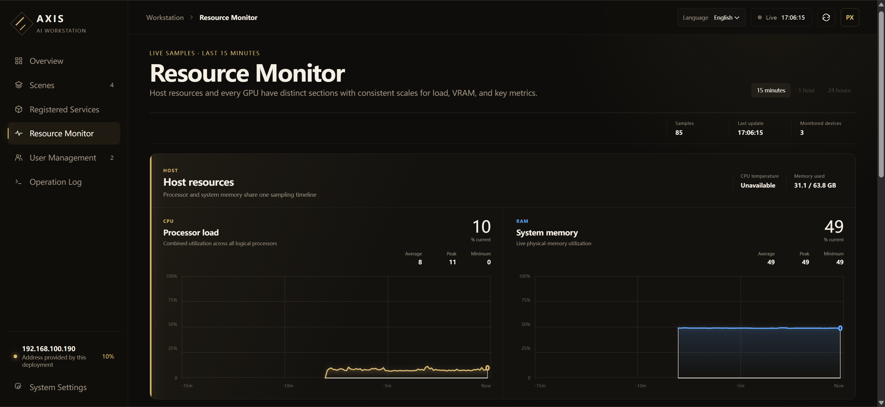
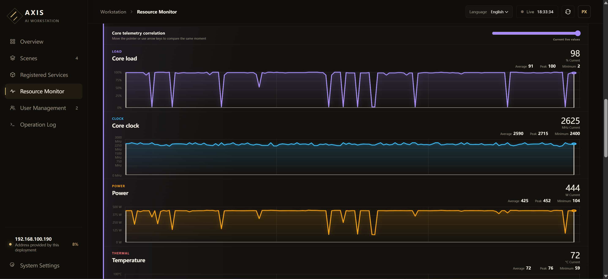

# AXIS AI Workstation Manager

English | [简体中文](README.zh-CN.md)

AXIS unifies the services of an AI workstation and organizes them into different scenes. It can switch all required services for a scene with one action while monitoring server status in real time. Its responsive UI supports monitoring and configuration from PC to mobile, and it can accommodate any service: ask AI to write or adapt an existing management script to the [scriptspec.md](scriptspec.md) contract. AXIS is a clean and straightforward service-management system for AI workstations.

## Interface preview

**Workstation overview**



**Work scenes**



**Registered services**



**Host resource monitoring**



**GPU core telemetry correlation**



## Features

- Register `.ps1`, `.cmd`, or `.bat` service-management scripts
- Start, stop, restart, and deep-check one service, or stop all services
- Detect external starts, stops, failures, and unexpected exits through lightweight local health checks
- Create and reorder scenes that switch an ordered group of services
- Monitor CPU, memory, and every detected NVIDIA GPU in distinct sections with consistent scales, current/average/peak/minimum values, and key hardware metrics
- Record service actions and scene-switch steps, times, and results
- Use Chinese, English, or automatic browser-language detection
- Choose Matrix Green, Aurora Blue, or Obsidian Gold display styles
- Manage multiple users

## Install and start

Windows and Python 3.11 or later are required.

```powershell
python -m pip install -r requirements.txt
python -m workstation_manager
```

Open:

```text
http://127.0.0.1:19100
```

Create the initial administrator on the first visit. Passwords must contain at least four characters. You can also double-click `Start-Manager.cmd` or run `Start-Manager.ps1`.

## Register a service

Open Registered Services and enter a name, description, and absolute management-script path. GPU label, port, and UI URL are display and navigation fields. A health-check URL and optional response match text let AXIS confirm the real service state automatically.

Every script must support four actions:

```powershell
D:\AIWork\example\manage.ps1 start
D:\AIWork\example\manage.ps1 stop
D:\AIWork\example\manage.ps1 restart
D:\AIWork\example\manage.ps1 status
```

AXIS never polls management scripts and never launches PowerShell, WSL, or Docker commands for background status monitoring. Every five seconds it checks registered local health URLs inside the manager process and changes a stable state only after two consecutive failures. The `status` action runs only when a user clicks Deep Check.

See [Script Requirements](SCRIPT_REQUIREMENTS.en.md) for the full contract and examples.

## Use scenes

Create a scene in Work Scenes and select its registered services. Before switching, AXIS refreshes lightweight observed health, stops only actually running services outside the target, and starts only target services that are not already running. Target startup begins only after every required stop succeeds.

The progress window shows every step and can cancel steps that have not started. Completed service actions are not rolled back automatically.

## Common configuration

Copy the example before changing settings:

```powershell
Copy-Item .\config\settings.example.json .\config\settings.json
.\Start-Manager.ps1 -ConfigFile .\config\settings.json
```

Most installations need only these fields:

| Field | Default | Purpose |
| --- | --- | --- |
| `host` | `127.0.0.1` | Listen address; after initial setup, use `0.0.0.0` for LAN access |
| `port` | `19100` | Manager port |
| `database_path` | `data/workstation-manager.db` | Users, services, scenes, and operation records |
| `sample_interval_seconds` | `5` | Resource sampling interval; it never calls service scripts |
| `history_minutes` | `1440` | SQLite resource-history retention in minutes |
| `script_status_timeout_seconds` | `3` | Timeout for a manual single-service deep check |
| `script_action_timeout_seconds` | `600` | Service-action timeout |

Resource monitoring writes one SQLite sample every 5 seconds by default and retains the latest 24 hours. The UI supports `15m`, `1h`, and `24h`; longer windows are aggregated by the server before they are returned. For each GPU, aligned charts and a linked pointer compare core load, clock, power, and temperature, while VRAM capacity remains separate. Only the latest 15 minutes remain in memory, so 24-hour history does not create a large in-memory buffer.

LAN mode does not provide HTTPS. Credentials travel over unencrypted HTTP, so use it only on a trusted LAN and never expose it directly to the internet.

## Start with Windows

Install a task that runs at sign-in:

```powershell
.\Install-ManagerTask.ps1
```

Install a system-start task with an explicit configuration file:

```powershell
.\Install-ManagerTask.ps1 -Trigger Startup -ConfigFile .\config\settings.json
```

Remove it with `.\Uninstall-ManagerTask.ps1`. The scheduled task starts AXIS only; it never starts registered services automatically.

## More documentation

- [Script Requirements](SCRIPT_REQUIREMENTS.en.md)
- [Development, complete API, and advanced configuration](DEVELOPMENT.en.md)
- [中文说明](README.zh-CN.md)
